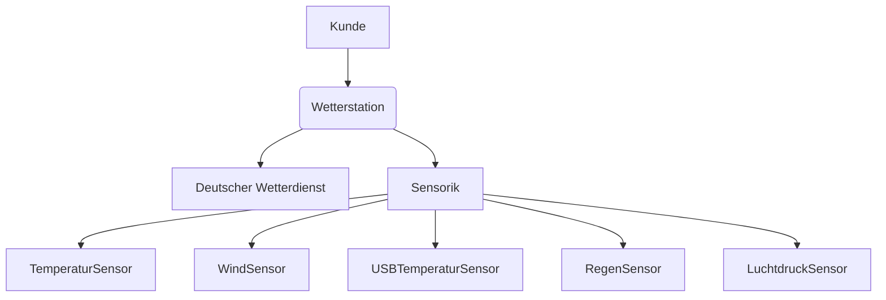
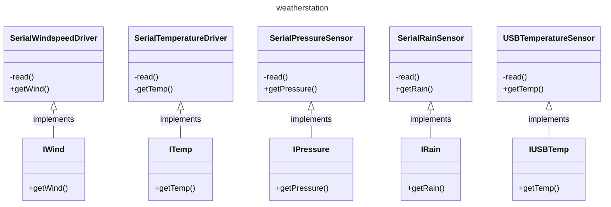
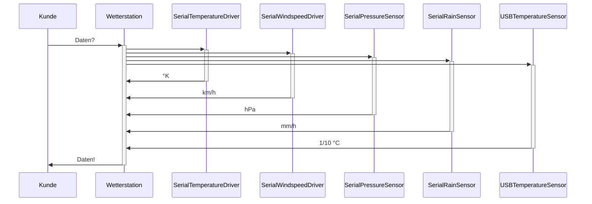

 Konzept der Wetterstation

## Diagramme
• Kontextabgrenzung

```mermaid
graph TD;
    A[Kunde] --> B(Wetterstation);
    B --> C[Deutscher Wetterdienst]
    B --> D[Sensorik]
    D --> F[TemperaturSensor];
    D --> E[WindSensor]
    D --> G[USBTemperaturSensor]
    D --> H[RegenSensor]
    D --> I[LuchtdruckSensor];
```
 

• Paket/Klassendiagramm

```mermaid
---
title: weatherstation
---
classDiagram

    SerialWindspeedDriver <|--  IWind: implements
    SerialTemperatureDriver <|--  ITemp : implements
    SerialPressureSensor <|--  IPressure : implements
    SerialRainSensor <|--  IRain : implements
    USBTemperatureSensor <|--  IUSBTemp : implements

   class SerialWindspeedDriver{
        -read()
        +getWind()
    }
    class SerialTemperatureDriver{
        -read()
        -getTemp()
    }
    class SerialPressureSensor{
        -read()
        +getPressure()
    }
    class SerialRainSensor{
        -read()
        +getRain()
    }
    class USBTemperatureSensor{
        -read()
        +getTemp()
    }
    class IWind{
        +getWind()
    }
    class ITemp{
        +getTemp()
    } 
    class IPressure{
        +getPressure()
    }
    class IRain{
        +getRain()
    }
    class IUSBTemp{
        +getTemp()
    }
    

```

• Sequenzdiagramm

```mermaid
sequenceDiagram
    Kunde->>+Wetterstation: Daten?
    Wetterstation->>+SerialTemperatureDriver: 
    Wetterstation->>+SerialWindspeedDriver: 
    Wetterstation->>+SerialPressureSensor: 
    Wetterstation->>+SerialRainSensor: 
    Wetterstation->>+USBTemperatureSensor: 
    SerialTemperatureDriver->>-Wetterstation: °K
    SerialWindspeedDriver->>-Wetterstation: km/h
    SerialPressureSensor->>-Wetterstation: hPa
    SerialRainSensor->>-Wetterstation: mm/h
    USBTemperatureSensor->>-Wetterstation: 1/10 °C
    Wetterstation->>-Kunde: Daten!    
```